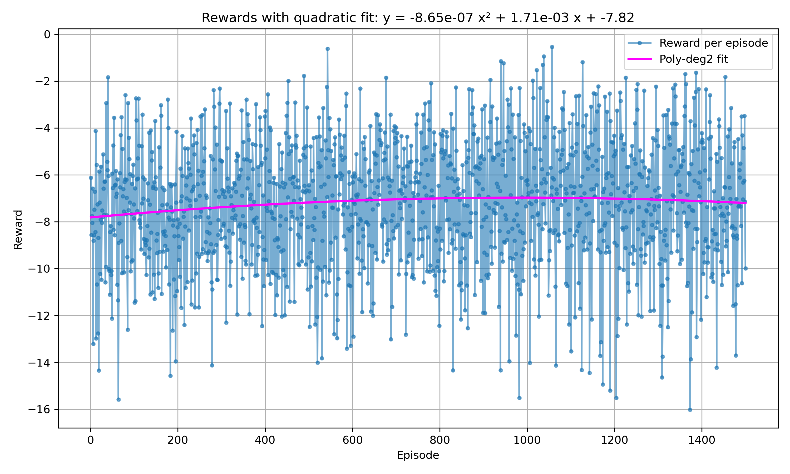
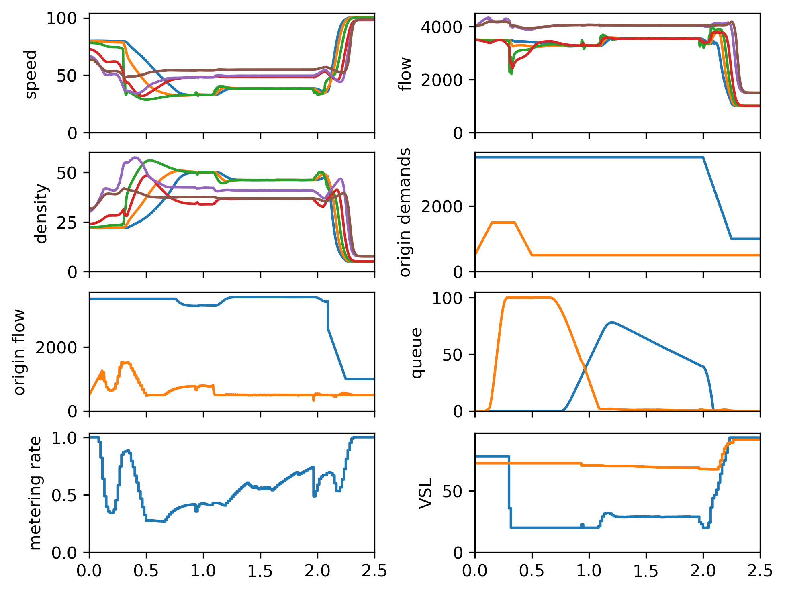

# MPC-DRL Framework for Freeway Traffic Control

**Project Overview:** This repository implements a hybrid **Model Predictive Control (MPC)** and **Deep Reinforcement Learning (DRL)** framework for freeway traffic control. The goal is to optimally manage ramp metering and variable speed limits (VSL) on a freeway to reduce congestion and improve traffic flow, by combining the strengths of MPC (optimal control using a model) with DRL (learned policy improvement). A **DDPG (Deep Deterministic Policy Gradient)** agent is trained on a macroscopic traffic model (the METANET model) to learn adjustments to an MPC-based control policy. The learned policy is then deployed and evaluated in a microscopic traffic simulator (SUMO) on a simple 6 km freeway stretch with an on-ramp. This project follows the methodology of the research paper *“A Novel Framework Combining MPC and Deep Reinforcement Learning With Application to Freeway Traffic Control,”* using the same network and control structure.

## System Requirements and Installation

* **Python:** The code is tested with **Python 3.x** (Python 3.9+ recommended for PyTorch).

* **Dependencies:** Install Python requirements with `pip install -r requirements.txt`. Key libraries include:

  * **CasADi 3.6.7:** For formulating and solving the MPC optimization problem (with IPOPT solver).
  * **csnlp 1.6.1:** CasADi-based NLP/MPC helper library for easier MPC problem definition.
  * **sym\_metanet 1.1.1:** A symbolic implementation of the METANET traffic flow model (used to build the macroscopic simulation).
  * **stable-baselines3 2.6.0:** DRL library used for the DDPG algorithm (requires PyTorch 2.6.0, which is included).
  * **Gymnasium 1.1.1:** For the custom environment interface (a Gym-compatible `MetanetMPCEnv` is defined).
  * **Matplotlib 3.9.2:** For plotting training curves and simulation results.
  * *(See `requirements.txt` for the full list of Python packages and exact versions.)*

* **SUMO Traffic Simulator:** The SUMO simulator (tested with **SUMO v1.22.0**) must be installed **separately** (not via pip). SUMO is used for microscopic simulation and closed-loop control testing. After installing SUMO, set the `SUMO_HOME` environment variable to the SUMO installation directory so that SUMO’s Python tools (TraCI) are available. For example, on Linux add to `~/.bashrc`: `export SUMO_HOME="/path/to/sumo"`. On Windows, set it in System Environment Variables. The code will exit with an error if `SUMO_HOME` is not defined.

**Installation Steps:** After cloning the repository, ensure you have a working Python 3 environment. Install the Python dependencies and ensure SUMO is installed and configured as above. No additional build steps are required.

## Repository Structure

```
MPC-DRL-Project/
├── running/
│   ├── training.py             # Training script for the DDPG agent on the METANET+MPC environment
│   ├── metanet_run.py          # Simulation script for macroscopic METANET model (No control vs MPC vs MPC+DRL)
│   └── sumo_run.py             # Simulation script for microscopic SUMO model (No control, MPC, or MPC+DRL mode)
├── my_metanet_mpc_env.py       # Definition of the custom Gym environment combining METANET and MPC
├── evaluation/
│   ├── plotting_rewards.py     # Plotting script for training rewards over episodes (reads logs)
│   ├── plot_demands.py         # Plotting script for the generated demand profiles
│   └── evaluate_ddpg_low_noise.py  # Runs a trained agent in the METANET env and plots sample outputs
├── network/
│   ├── toy_highway_network.net.xml   # SUMO network file (6 km freeway with one on-ramp)
│   ├── toy_highway_network.rou.xml   # SUMO route file defining traffic demands
│   ├── toy_highway_network.sumocfg   # SUMO configuration file (ties network, routes, outputs)
│   └── edge_logging.add.xml         # SUMO additional file (for edge-based logging in simulation)
├── logs/
│   └── low/                # Example log directory for a training scenario (e.g., "low" noise)
│       ├── monitor.csv            # Episode rewards and lengths logged during training
│       ├── actual_demands.csv     # Actual generated demand profile used in training
│       └── ddpg_low_final.zip     # Saved DDPG policy after training (Stable-Baselines3 .zip format) 
├── plots/                   # (Optional) This folder will contain output plots generated by evaluation scripts
│       ├── low_noise_rewards_per_episode.png   # Example: training reward curve plot (from plotting_rewards.py)
│       ├── density.png                     # Example: traffic density vs time plot (from evaluation script)
│       └── ramp_metering_rate.png          # Example: ramp metering rate vs time plot (from evaluation script)
└── previous_work/           # Deprecated code from earlier project stages (not used in final framework)
    ├── sumo_prev/ ...       # Older SUMO control scripts and experiments
    └── metanet/ ...         # Older METANET model scripts and prototypes
```

* **`running/`** – **Main scripts** for training and simulation. The training and evaluation (simulation) components are separated, and each script is run independently (there is no single monolithic run). For instance, `training.py` trains the DRL agent, while `metanet_run.py` and `sumo_run.py` are used after training to evaluate performance on the macro and micro models respectively.
* **`my_metanet_mpc_env.py`** – Defines the **Gym environment** `MetanetMPCEnv` that encapsulates the METANET traffic model and an embedded MPC controller. This environment is where the DDPG agent interacts during training. It sets up a 6 km freeway with 1 on-ramp and includes the MPC logic for ramp/VSL control. Observations include traffic state (densities, speeds, queue lengths) and the MPC’s suggested control, while actions represent adjustments to ramp metering (0 to 1) and VSL values.
* **`evaluation/`** – Contains **analysis and plotting scripts** to interpret results. These help visualize training progress (e.g., reward curves), demand profiles, or evaluate the trained agent’s behavior. They are not essential for running the control but are useful for generating the figures and understanding performance. For example, `plotting_rewards.py` reads the training log and produces a reward-per-episode plot, and `evaluate_ddpg_low_noise.py` runs a rollout of the final agent in the environment to plot metrics like density and control signals.
* **`network/`** – Contains the SUMO network configuration for the test scenario. The network represents a simple freeway with a single on-ramp after 4 km (total mainline length \~6 km). The `.net.xml` file defines the road segments, `.rou.xml` defines vehicle inflows (traffic demand), and `.sumocfg` ties them together and sets simulation parameters (simulation end time \~3.75 hours to cover warm-up, main control period of 2.5 h, and cool-down). The SUMO config also specifies output files (e.g., summary and trip info logs in a **Logs/** directory) for post-simulation analysis.
* **`logs/`** – Outputs from training runs. Each training scenario (e.g., “low”, “medium”, “high” demand noise) will create a subfolder here. Within, you’ll find `monitor.csv` (episode rewards, lengths), `actual_demands.csv` (the realized demand profile with noise used in training), and saved model checkpoints. After training is complete, the final policy is saved as a `.zip` file (for example, `ddpg_low_final.zip` for the low-noise scenario). You can train multiple scenarios by adjusting the code (e.g., different noise levels or hyperparameters) and keeping separate log folders.
* **`plots/`** – This folder is intended to store figures generated by the plotting scripts or by saving simulation output graphs. (It may be empty until you run those scripts.) For instance, after running `plotting_rewards.py`, a file `low_noise_rewards_per_episode.png` will appear here showing the training reward curve. Similarly, the evaluation scripts can save plots such as density time series or control signals into this directory.
* **`previous_work/`** – *Deprecated/legacy code.* This contains earlier attempts and experiments (including an older SUMO control interface and METANET simulations) from the initial phase of the project. These are **not used** in the current framework and can be ignored for running the main results. (They were kept for reference but the final implementation is in the main `running/` scripts and `my_metanet_mpc_env.py`.)

## Training the MPC+DRL Agent (Macroscopic Model)

To train the DRL agent, run the **training script**:

```bash
python running/training.py
```

This will launch the training loop for the DDPG agent using the `MetanetMPCEnv` environment. The environment simulates a **macroscopic traffic model (METANET)** for 2.5 hours of peak traffic and includes an **MPC controller** that computes optimal ramp metering and VSL actions over a short horizon. The DRL agent observes the state (normalized densities, speeds, queues, etc. over the freeway) along with the MPC’s current control recommendation, and learns to output **action adjustments** for ramp metering (a delta to the metering rate) and VSL (adjustments to the speed limit). The reward is designed to penalize total time spent (to encourage higher throughput and lower congestion) while also penalizing excessive control changes and long queue lengths on the on-ramp.

By default, the training script is configured for a **“low” demand noise scenario** (i.e. slight stochastic variations in the traffic demand) as an example. You can modify the `scenarios` dictionary in `training.py` to run different demand profiles or noise levels (e.g., “medium” or “high” noise) – this will create separate log subdirectories and models for each scenario. The training uses Stable-Baselines3’s DDPG implementation with an Ornstein-Uhlenbeck noise for exploration. Key hyperparameters (like learning rate schedule, replay buffer size, etc.) are set in the script. The training runs for a fixed number of time steps (e.g., 22500 steps corresponding to 150 training episodes of 2.5h each, by default) and periodically saves intermediate checkpoints (every 100 episodes) as well as the final policy model.

During training, progress is logged to the console and to the `logs/<scenario>/monitor.csv` file (which records per-episode rewards and lengths). The script also saves the exact **demand profile** used (combining base demand plus noise) into `actual_demands.csv` for later analysis. After training completes, the final trained agent is saved to `logs/<scenario>/ddpg_<scenario>_final.zip` (along with its replay buffer). This `.zip` file contains the neural network weights and can be reloaded for simulation.

**Note:** Training can be time-consuming since each episode involves solving many MPC problems. Ensure that CasADi and the IPOPT solver are properly installed for efficiency. You may observe the episode reward increasing over time as the agent learns to reduce congestion (this can be visualized with the provided plotting script or the example plot below). If needed, you can adjust training duration or hyperparameters in `training.py`.


&#x20;*Training performance over episodes.* *The plot above shows the reward per episode during training of the DDPG agent (blue curve) for the **low-noise** scenario, indicating improving performance as the agent learns. A quadratic trendline (magenta) is fitted to highlight the upward trend. Higher rewards correlate with lower overall congestion (less total time spent by vehicles). By around 150 episodes, the reward stabilizes, suggesting the policy converged toward an improved control strategy.*

## Macroscopic Evaluation (METANET Simulation)

After training, you can evaluate the learned policy in the **macroscopic METANET model** alongside baseline controls. Run:

```bash
python running/metanet_run.py
```

This script simulates the freeway using the METANET model under three conditions: **no control**, **MPC control only**, and **MPC+DRL control**. By default, all three cases are executed in sequence (flags `RUN_NO_CTRL`, `RUN_MPC_CTRL`, `RUN_MPC_DRL_CTRL` are set to `True` in the script). The simulation uses the same demand profile and model as in training. For the MPC+DRL case, it will **load the trained DDPG agent** (from the `logs/low/ddpg_low_final.zip` file by default) and use it to provide adjustments on top of the MPC actions. (If you trained a different scenario or have a differently named model, you may need to update the path in the script accordingly before running.)

When you run `metanet_run.py`, it will output key performance metrics for each scenario to the console. In particular, after each simulation case, it prints the **Vehicle Kilometers Traveled (VKT)**, **Vehicle Hours Traveled (VHT)** – also interpreted as total time spent – and the resulting **average speed** over the simulation. These metrics allow quantitative comparison of the scenarios (e.g., you should observe that MPC control improves average speed over no control, and MPC+DRL further improves or maintains it while reducing on-ramp queue penalties).

The script also generates **plots** to visualize the traffic state and control behavior. For each scenario (no control, MPC, MPC+DRL), it plots time-series of: mainline **speeds**, **flows**, **densities** on the freeway, the **origin (demand) flows** vs. the **origin input demands**, and the **queue lengths** at the on-ramp over time. These are displayed in a 3x2 grid of subplots for a comprehensive view of the system’s response. Additionally, the script creates **time-space diagrams** for each scenario – 2D colormaps with time on the x-axis and position along the freeway on the y-axis – for speed, density, and flow. These diagrams vividly show the formation of congestion waves (regions of low speed/high density) over the freeway and how the control strategies alleviate them. The plots are shown on screen (`plt.show()` is used) – you can visually compare, for example, that with **MPC+DRL control** the freeway maintains higher speeds (fewer red/high-density regions) compared to the uncontrolled case.

The METANET evaluation confirms that the DRL-enhanced controller meets the objectives on the model it was trained on. For instance, you may see that the **on-ramp queue** is managed: pure MPC might strictly limit the ramp flow causing a long queue, whereas the DRL+MPC controller can intelligently balance ramp metering to prevent excessive queue build-up while still protecting the mainline. The result is an improved trade-off between freeway flow and ramp delays. Quantitatively, average speeds can increase and total time spent decrease in the MPC+DRL case compared to MPC alone.

*(All plots from `metanet_run.py` are displayed when the script runs. If needed, you can modify the script to save these figures to files for inclusion in reports. The code is structured for clarity, with separate sections handling each scenario.)*


&#x20;*Traffic state and control in the macroscopic model.* *The figure above is an example **time-series output** from the METANET simulation. It shows the evolution of key variables over time for one of the control scenarios. In the bottom-right subplot, the on-ramp **queue length** is plotted over the 2.5 h simulation. With an effective control strategy, the on-ramp queue (orange line) is kept below its capacity (100 vehicles) and dissipates after the peak demand, whereas in a less optimal scenario the queue could grow uncontrolled. Other subplots (top rows) illustrate **speed** and **flow** profiles over time, and the demand vs actual entering flow. This demonstrates how the MPC+DRL policy regulates traffic: by temporarily holding vehicles at the ramp (metering) when mainline traffic is heavy, it prevents breakdown and maintains higher mainline speeds.*

## Microscopic Evaluation (SUMO Simulation)

The ultimate test of the trained policy is to deploy it in a **microscopic traffic simulation**. We use **SUMO** (Simulation of Urban MObility) to model individual vehicles on the same freeway stretch. The file `running/sumo_run.py` allows you to run the SUMO simulation under different control modes. Before running this, ensure SUMO is installed and `SUMO_HOME` is set (as described earlier). Then execute:

```bash
python running/sumo_run.py
```

By default, `sumo_run.py` will launch the SUMO GUI and run the scenario. At the top of the script, you can set the variable `RUN_MODE` to choose the control strategy: `"NO_CTRL"` (no ramp metering, no VSL control), `"MPC"` (model predictive control only), or `"MPC_DRL"` (the combined MPC + DRL policy). Make sure `RUN_MODE` is set to the desired mode *before* running the script. For the `"MPC_DRL"` mode, the script expects a trained agent file to load. It constructs the path to `../logs/low/ddpg_low_final.zip` by default and loads that DDPG model. (You can change this path if your model is stored elsewhere or if you want to test a medium/high noise policy.)

When executed, the script will start SUMO with the network defined in `network/toy_highway_network.sumocfg`. This network consists of a freeway with 2 lanes in each direction, an on-ramp merging at node N2 (4 km from the start), and traffic demand defined in the route file. The simulation runs for about 3.75 hours (13500 seconds) including a 30 min warm-up and 45 min cool-down to observe pre- and post-peak conditions.

SUMO will open a window (if using `sumo-gui`) where you can watch vehicles entering from the mainline source and the on-ramp. The `sumo_run.py` script uses **TraCI** (Traffic Control Interface) to: retrieve real-time traffic measurements and apply controls each simulation step. Specifically, every simulation step (set to 1s), it reads lane densities, speeds, and queue lengths on relevant road segments using TraCI, and if control is enabled, it sets the traffic light at the on-ramp to meter flow and adjusts the speed limits on certain mainline segments. The combined MPC+DRL logic runs every Δt (e.g., 60s) similar to the training, but the script continuously applies the last chosen control values each second in between.

For **output and visualization**, the script collects data in a `results_sumo` dictionary and uses Matplotlib to create plots at the end of the simulation. It will display **time-space heatmaps** of speed, density, and flow over the length of the freeway – these are analogous to the METANET diagrams but now coming from the high-fidelity SUMO simulation. In these plots, you can see, for example, the formation of a congestion wave on the mainline if the ramp is not metered (large red area in the speed heatmap), versus a more controlled situation with MPC or MPC+DRL (smaller or no red areas, indicating higher speeds). The script also plots the time series of the control actions: ramp metering rate and VSL setpoints. In **MPC+DRL mode**, it will show two curves for each: the base MPC action vs the action after DRL adjustment, over time. This lets you see how the RL agent modulates the MPC suggestions – for instance, the DRL might allow a higher ramp flow (higher metering rate) at certain times to prevent the queue from growing too large, which would appear as the “MPC+DRL” ramp rate curve diverging above the pure MPC curve. Similarly, for VSL, the DRL might slightly lower or raise the speed limit compared to the pure MPC strategy to respond to traffic conditions.

All these plots will appear in separate windows at the end of the SUMO run (`plt.show()` is invoked). You can close them to return to the prompt. The SUMO simulation also writes some output files as specified in the config: for example, `Logs/log_summary.xml` containing summary statistics (e.g., average speeds, waiting times at intervals) and `Logs/log_trip_info.xml` with individual vehicle trip details. These can be examined with SUMO’s tools if needed (e.g., using `plotXMLAttributes.py` as noted in `network/README.md`, though this is optional).

**Note:** If you prefer to run SUMO in command-line mode (without the GUI), you can edit `Sumo_config` in `sumo_run.py` to use the `"sumo"` binary instead of `"sumo-gui"`. Also, ensure that the SUMO `tools` and `libsumo` paths are correctly added (the script does this automatically via the `SUMO_HOME` variable). The simulation speed can be increased by using command-line mode or setting a larger step length, but the default 1s step is used to match the control cycle.

**Interpreting Results:** The SUMO-based evaluation is the most realistic test. You should observe that the **MPC+DRL controller improves traffic performance** compared to no control or even pure MPC. For example, under heavy demand the no-control case may result in a breakdown: low speeds (seen as red zones in the heatmap) and a large queue spilling from the on-ramp onto surface streets. Pure MPC control will mitigate this by throttling the on-ramp (ramp metering) and dropping VSL, but might cause a long queue at the ramp. The hybrid MPC+DRL controller aims to reduce that queue penalty: vehicles are metered just enough to avoid mainline breakdown, but whenever possible the agent increases ramp flow to service the queue, all while maintaining stable mainline speeds. This manifests as **shorter queues** and **higher average speeds** overall. The exact numbers can be quantified from the summary outputs or by comparing the VKT/VHT, but qualitatively the time-space plots and control time-series give a clear picture of improvements.

## Conclusion

This hybrid MPC-DRL framework provides a novel approach to freeway traffic control by leveraging a physics-based model and optimal control (MPC) in tandem with learned intelligence (DRL). The **MPC component** provides a strong baseline by optimizing over a model predictive horizon, while the **DRL agent** observes the system’s response and fine-tunes the control actions, compensating for unmodeled effects or changing conditions. The result, as demonstrated in both macroscopic and microscopic simulations, is a controller that outperforms purely model-based or purely learned controllers alone.

The structure and results here are based on the framework introduced in the referenced research paper, and this repository serves as a working implementation for further experimentation. Users can adjust demand scenarios, retrain the agent, or extend the approach to more complex networks. We hope this repository serves as a solid starting point for research into combined MPC and DRL for traffic systems and beyond.
